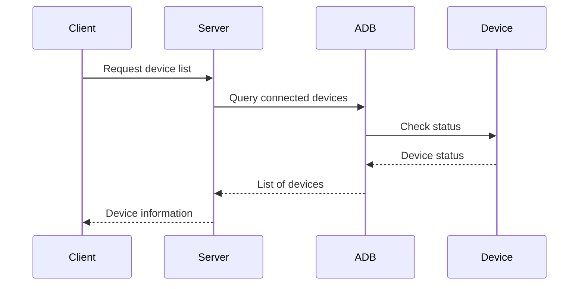
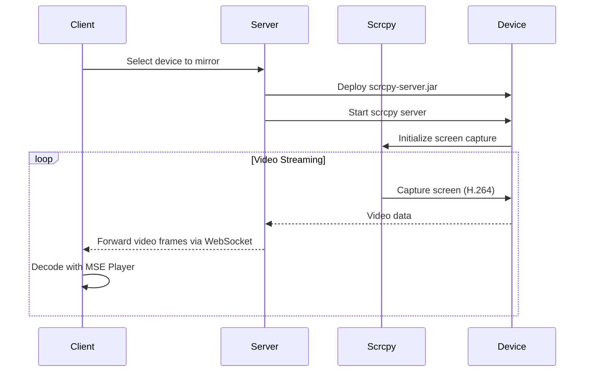
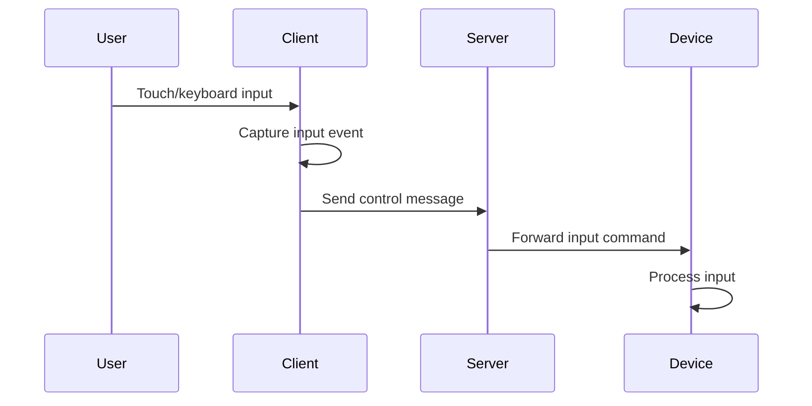

# Understanding Device Mirroring in ws-scrcpy

This document provides a detailed technical explanation of how device screen mirroring works in the ws-scrcpy application, with code snippets to illustrate the flow from server to client.

## Table of Contents

1. [Architecture Overview](#architecture-overview)
2. [Server-Side Components](#server-side-components)
3. [Client-Side Components](#client-side-components)
4. [Data Flow](#data-flow)
5. [Key Technical Concepts](#key-technical-concepts)

## Architecture Overview

ws-scrcpy uses a client-server architecture:

- **Server**: Node.js application that communicates with Android devices via ADB
- **Client**: Browser-based UI that displays device screens and handles user input
- **Communication**: WebSockets for bidirectional real-time data transfer


## Server-Side Components

### 1. Device Connection and Management

The server starts by setting up HTTP and WebSocket servers and initializing device tracking.

```typescript
// src/server/index.ts (simplified)
import { HttpServer } from './services/HttpServer';
import { WebSocketServer } from './services/WebSocketServer';
import { ControlCenter } from './goog-device/services/ControlCenter';
import { DeviceTracker } from './goog-device/mw/DeviceTracker';

const servicesToStart = [HttpServer, WebSocketServer, ControlCenter];
const mwList = [WebsocketProxy, WebsocketMultiplexer]; // WebSocket middleware
const mw2List = [HostTracker, DeviceTracker]; // Multiplexer middleware

Promise.all(loadPlatformModulesPromises)
    .then(() => {
        for (const ServiceClass of servicesToStart) {
            const service = new ServiceClass();
            service.registerMwFactory(mwList);
            service.registerMw2Factory(mw2List);
            service.start();
            runningServices.push(service);
        }
    });
```

### 2. The ScrcpyServer Class

This class manages the deployment and execution of the scrcpy-server.jar on target Android devices.

```typescript
// src/server/goog-device/ScrcpyServer.ts (simplified)
export class ScrcpyServer {
    private static PID_FILE_PATH = '/data/local/tmp/ws_scrcpy.pid';
    
    private static async copyServer(device: Device): Promise<PushTransfer> {
        const src = path.join(FILE_DIR, FILE_NAME);
        const dst = TEMP_PATH + FILE_NAME;
        return device.push(src, dst);
    }

    public static async start(device: Device, ...options: string[]): Promise<number | undefined> {
        // Copy the server to the device
        await this.copyServer(device);
        
        // Start the server process
        const command = `${RUN_COMMAND} ${SERVER_PACKAGE} ${SERVER_VERSION} ${options.join(' ')}`;
        await device.runShellCommand(command);
        
        // Wait for PID file to confirm server is running
        const pid = await this.waitForServerPid(device, {
            tryCounter: 0,
            processExited: false,
            lookPidFile: true,
        });
        
        return pid?.[0];
    }
}
```

### 3. WebSocket Middleware

The `Mw` class serves as the base for all middleware that handles WebSocket connections:

```typescript
// src/server/mw/Mw.ts (simplified)
export abstract class Mw {
    protected constructor(protected readonly ws: WS | Multiplexer) {
        // We need to handle both WebSocket and Multiplexer with compatible event handling
        const wsAny = this.ws as any;
        wsAny.addEventListener('message', this.onSocketMessage.bind(this));
        wsAny.addEventListener('close', this.onSocketClose.bind(this));
    }

    protected abstract onSocketMessage(event: MessageEvent | WS.MessageEvent): void;

    protected sendMessage = (data: Message): void => {
        if (this.ws.readyState !== this.ws.OPEN) {
            return;
        }
        this.ws.send(JSON.stringify(data));
    };

    public release(): void {
        const { readyState, CLOSED, CLOSING } = this.ws;
        if (readyState !== CLOSED && readyState !== CLOSING) {
            this.ws.close();
        }
    }
}
```

## Client-Side Components

### 1. Media Player Implementation

The MsePlayer class handles video decoding and rendering using Media Source Extensions:

```typescript
// src/app/player/MsePlayer.ts (simplified)
export class MsePlayer extends BasePlayer {
    private converter?: VideoConverter;
    private mediaSource?: MediaSource;
    private sourceBuffer?: SourceBuffer;
    private frames: Uint8Array[] = [];
    
    constructor(udid: string, displayId: number, name?: string) {
        super(udid, displayId, name);
        this.tag = MsePlayer.createElement(this.buildId());
    }

    protected doPlay(): void {
        // Create MediaSource and attach to video element
        const mediaSource = new MediaSource();
        mediaSource.addEventListener('sourceopen', this.onSourceOpen);
        this.mediaSource = mediaSource;
        this.tag.src = URL.createObjectURL(mediaSource);
    }
    
    private onSourceOpen = (): void => {
        // Create source buffer for video data
        const mediaSource = this.mediaSource as MediaSource;
        const sourceBuffer = mediaSource.addSourceBuffer(mimeType);
        sourceBuffer.mode = 'sequence';
        sourceBuffer.addEventListener('updateend', this.onUpdateEnd);
        this.sourceBuffer = sourceBuffer;
        
        // Create video converter
        this.converter = new VideoConverter();
        this.converter.addEventListener('frame', this.onFrame);
        this.canPlay = true;
    };
    
    private onFrame = (event: any): void => {
        // Queue video frames
        const frame = event.detail as Uint8Array;
        this.frames.push(frame);
        this.appendNextFrame();
    };
    
    public pushFrame(frame: Uint8Array): void {
        // Process incoming H.264 frames
        if (this.converter) {
            this.converter.decode(frame);
        }
    }
}
```

### 2. Stream Client Implementation

The `StreamClientScrcpy` class manages the connection to the device and handles user interactions:

```typescript
// src/app/googDevice/client/StreamClientScrcpy.ts (simplified)
export class StreamClientScrcpy extends BaseClient<ParamsStreamScrcpy, never> implements KeyEventListener {
    protected player?: BasePlayer;
    private interactionHandler?: FeaturedInteractionHandler;
    private filePushHandler?: FilePushHandler;
    
    public static ACTION = 'stream';
    
    constructor(params: ParamsStreamScrcpy) {
        super(params);
        this.buildQueryParameter();
    }
    
    protected async runWebsocket(): Promise<void> {
        // Create a player for video rendering
        this.player = this.createPlayer();
        
        // Set up interaction handler for touch/mouse events
        this.interactionHandler = new FeaturedInteractionHandler(this.player, {
            sendMessage: this.sendMessage,
        });
        
        // Set up file pushing
        this.filePushHandler = new FilePushHandler(this.params.udid);
        
        // Register for keyboard events
        KeyInputHandler.addEventListener(this);
        
        // Start streaming
        this.sendMessage({ type: 'start' });
    }
    
    private sendMessage = (message: ControlMessage): void => {
        // Send control messages to server
        this.ws?.send(JSON.stringify(message));
    };
    
    public onKeyEvent(event: KeyCodeControlMessage): void {
        // Handle keyboard events
        this.sendMessage(event);
    }
    
    // Video frame handler
    protected onVideoData(data: ArrayBuffer): void {
        if (this.player) {
            // Convert ArrayBuffer to Uint8Array and pass to player
            const uint8 = new Uint8Array(data);
            this.player.pushFrame(uint8);
        }
    }
}
```

## Data Flow

### 1. Device Detection Flow



### 2. Video Streaming Flow



### 3. User Input Flow



## Key Technical Concepts

### 1. H.264 Video Encoding/Decoding

The device encodes its screen using H.264, which offers good compression while maintaining quality:

```typescript
// src/app/player/MsePlayer.ts
public static readonly preferredVideoSettings: VideoSettings = new VideoSettings({
    bitrate: 7340032,
    maxFps: 60,
    iFrameInterval: 10,
    bounds: new Size(720, 720),
    sendFrameMeta: false,
});
```

### 2. WebSocket Communication

WebSockets provide a persistent, low-latency, bidirectional connection:

```typescript
// Connection setup in client
protected async runWebsocket(): Promise<void> {
    const protocol = location.protocol === 'https:' ? 'wss:' : 'ws:';
    const wsUrl = `${protocol}//${this.params.host}:${this.params.port}/`;
    this.ws = new WebSocket(wsUrl);
    this.ws.binaryType = 'arraybuffer';
    this.ws.addEventListener('open', this.onOpen);
    this.ws.addEventListener('message', this.onMessage);
    this.ws.addEventListener('close', this.onClose);
    this.ws.addEventListener('error', this.onError);
}
```

### 3. Media Source Extensions (MSE)

MSE allows JavaScript to generate media streams for playback:

```typescript
// src/app/player/MsePlayer.ts
private onSourceOpen = (): void => {
    const mediaSource = this.mediaSource as MediaSource;
    const sourceBuffer = mediaSource.addSourceBuffer(mimeType);
    sourceBuffer.mode = 'sequence';
    sourceBuffer.addEventListener('updateend', this.onUpdateEnd);
    this.sourceBuffer = sourceBuffer;
    
    this.converter = new VideoConverter();
    this.converter.addEventListener('frame', this.onFrame);
    this.canPlay = true;
};
```

### 4. Multiplexing

The application uses a custom multiplexer to manage multiple logical streams over a single WebSocket:

```typescript
// src/packages/multiplexer/Multiplexer.ts (concept)
export class Multiplexer {
    private readonly channels = new Map<string, Channel>();
    
    constructor(private readonly ws: WebSocket) {
        this.ws.addEventListener('message', this.onMessage);
    }
    
    // Creates logical channel with ID
    public createChannel(id: string): Channel {
        const channel = new Channel(id, this);
        this.channels.set(id, channel);
        return channel;
    }
    
    // Routes incoming messages to appropriate channel
    private onMessage = (event: MessageEvent): void => {
        const message = Message.fromEvent(event);
        const channel = this.channels.get(message.channelId);
        if (channel) {
            channel.onMessage(message);
        }
    };
    
    // Sends message through the underlying WebSocket
    public send(channelId: string, data: any): void {
        const message = new Message(channelId, data);
        this.ws.send(message.toBuffer());
    }
}
```

## Conclusion

The ws-scrcpy application provides a seamless device mirroring experience through a sophisticated combination of technologies:

1. **Server-side**: Manages device connections via ADB and runs the scrcpy server on target devices
2. **Client-side**: Renders H.264 video using MSE and captures user input
3. **Communication**: Uses WebSockets for low-latency bidirectional data transfer
4. **Video Processing**: Efficiently handles H.264 encoded video for optimal performance

This architecture allows for a responsive, browser-based mirroring solution that works across different platforms without requiring any software installation on the client side.
